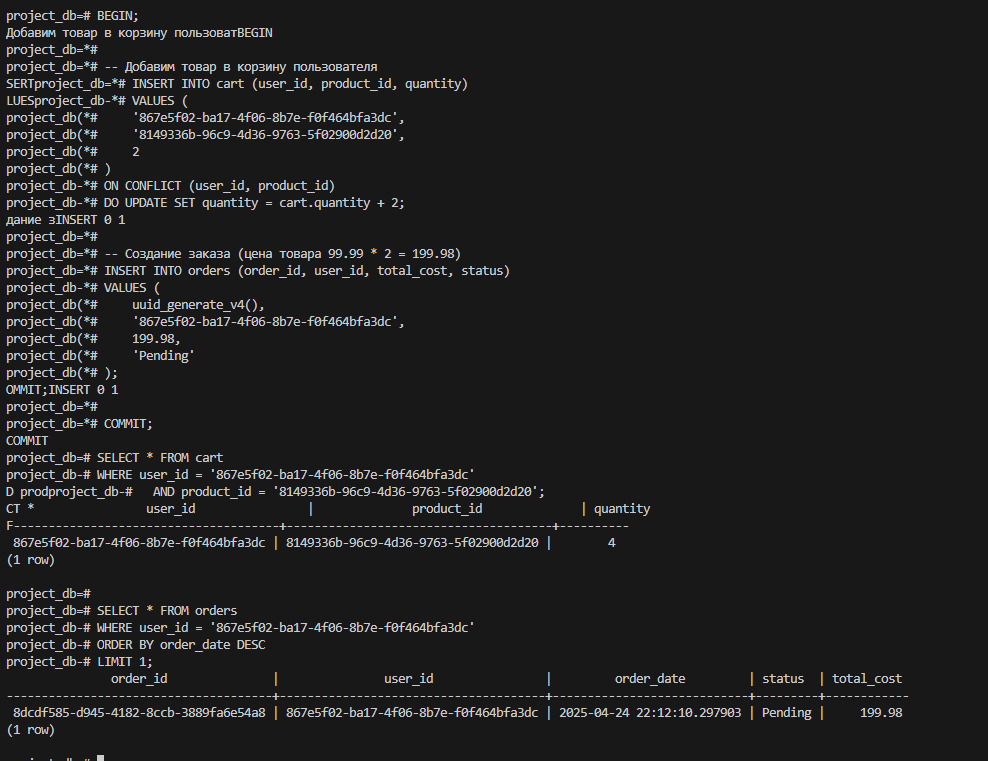
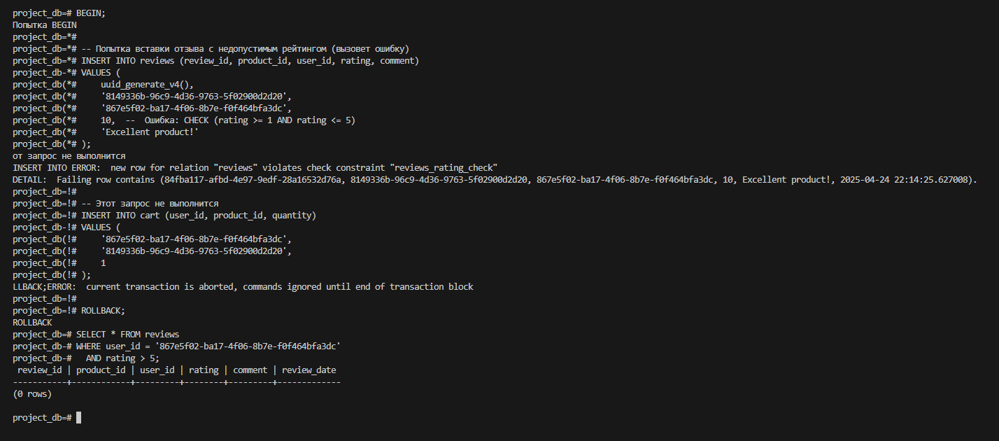
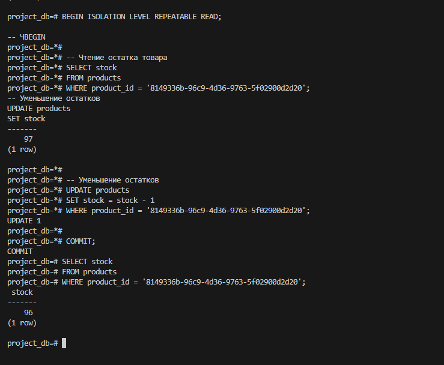
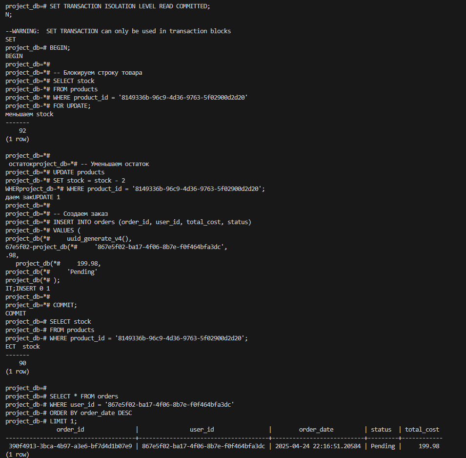

## Первая транзацкия



## Вторая транзацкия



## Третья транзакция



## Четвертая транзакция



## Аномалии

### Грязное чтение (чтение незафиксированных данных из другой транзакции, которые могут быть отменены)

```sql
-- 1-я сессия
project_db=# BEGIN;
-- DATEBEGIN

project_db=*# UPDATE products
project_db-*# SET price = 3000
project_db-*# WHERE product_id = '8149336b-96c9-4d36-9763-5f02900d2d20';
UPDATE 1

-- 2-я сессия
project_db=# BEGIN ISOLATION LEVEL READ COMMITTED;
-- ELECBEGIN

project_db=*# SELECT price
project_db-*# FROM products
project_db-*# WHERE product_id = '8149336b-96c9-4d36-9763-5f02900d2d20';
 price
--------
 149.00
(1 row)

project_db=*# COMMIT;
COMMIT

-- Возврат к 1-й сессии
project_db=*# ROLLBACK;
ROLLBACK
```

### Non-repeatable read

```sql
-- 1 сессия
project_db=# BEGIN ISOLATION LEVEL READ COMMITTED;
- ПервыйBEGIN
project_db=*#
 SELEproject_db=*# -- Первый SELECT
project_db=*# SELECT price
project_db-*# FROM products
project_db-*# WHERE product_id = '8149336b-96c9-4d36-9763-5f02900d2d20';
  price
---------
 3000.00
(1 row)

-- 2 сессия
project_db=# BEGIN;
BEGIN
project_db=*# UPDATE products
project_db-*# SET price = 30000
project_db-*# WHERE product_id = '8149336b-96c9-4d36-9763-5f02900d2d20';
COMMUPDATE 1
project_db=*# COMMIT;
COMMIT

-- 1 сессия
project_db=*# SELECT price
project_db-*# FROM products
project_db-*# WHERE product_id = '8149336b-96c9-4d36-9763-5f02900d2d20';
  price
----------
 30000.00
(1 row)

project_db=*# COMMIT;
COMMIT
project_db=#
```

### Фантомное чтение

```sql
-- 1 сессия
project_db=# INSERT INTO categories (category_id, name)
project_db-# VALUES ('00000000-0000-0000-0000-000000000099', 'Electronics')
project_db-# ON CONFLICT DO NOTHING;
INSERT 0 0   
project_db=# BEGIN ISOLATION LEVEL READ COMMITTED;
BEGIN
project_db=*#
project_db=*# -- Первый COUNT
project_db=*# SELECT COUNT(*)
project_db-*# FROM products p
project_db-*# JOIN categories c ON p.category_id = c.category_id
project_db-*# WHERE c.name = 'Electronics';
 count 
-------
     1
(1 row)

-- 2 сессия
project_db=# BEGIN;
BEGIN
project_db=*# INSERT INTO products (product_id, name, category_id, price, stock, manufacturer)
project_db-*# VALUES (
project_db(*#     uuid_generate_v4(),
project_db(*#     'Headphones',      
project_db(*#     '00000000-0000-0000-0000-000000000099',
project_db(*#     149.99,
project_db(*#     20,
project_db(*#     'Sony'
project_db(*# );
IT;INSERT 0 1
project_db=*# COMMIT;
COMMIT

--1 сессия
project_db=*# SELECT COUNT(*) 
project_db-*# FROM products p
project_db-*# JOIN categories c ON p.category_id = c.category_id
project_db-*# WHERE c.name = 'Electronics';
и количество уве count
-------
     2
(1 row)

project_db=*# -- Если количество увеличилось — фантомное чтение
project_db=*#
project_db=*# COMMIT;
COMMIT
```